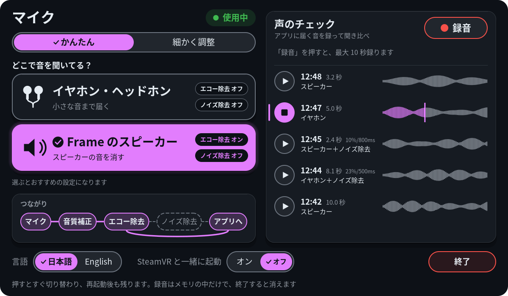
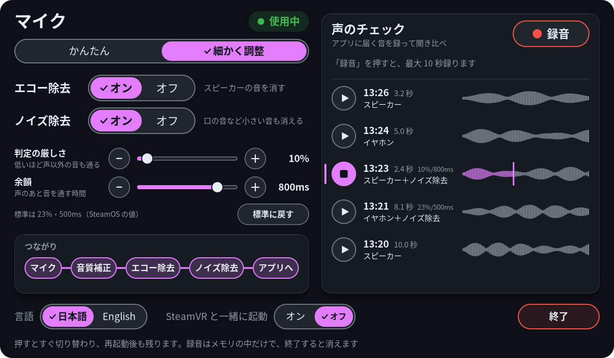

# Frame Mic Tuner

Steam Frame を被ったまま、ヘッドセットのマイクのエコー除去とノイズ除去を SteamVR のダッシュボードから切り替えるパネルです。イヤホンのときはエコー除去を切って、口の音のような小さな音まではっきり入るように。Frame のスピーカーを使うときはエコー除去を入れて、スピーカーの音がマイクに回り込まないようにします。アプリに実際に届く音を数秒録って、その場で聞き比べる「声のチェック」も付いています。

[English](README.md)

| かんたん（プリセット） | 細かく調整 |
|---|---|
|  |  |

## できること

- **2 つのタブ**: **かんたん** にプリセット、**細かく調整** に 1 つずつの切り替えとバーがあります。パネルを開くと、最後に見ていたタブが出ます
- **聞き方のプリセット**（かんたんのタブ、「どこで音を聞いてる？」）: **イヤホン・ヘッドホン** を押すとエコー除去オフ・ノイズ除去オフに、**Frame のスピーカー** を押すとエコー除去オン・ノイズ除去オフにします。何が変わるかは各カードに出ていて、今の設定と一致するカードが選択中になります。**細かく調整** のタブでは、エコー除去とノイズ除去をそれぞれ別にオン・オフできます。どちらのプリセットとも一致しないときは、両方のカードがグレーになります。マイクを使っている最中でも音を途切れさせずにすぐ切り替わり、再起動しても残ります
- **ノイズ除去の強さ**: 2 本のバーで、その場で調整できます。**判定の厳しさ**（どれだけ声らしい音なら通すか。低いほど声以外の音も通る）と、**余韻**（話し終わってから音を通し続ける時間）です
- **つながり**: マイクを使っているアプリがいるか、音が実際にどのフィルターを通っているか（マイク → 音質補正 → エコー除去 → ノイズ除去 → アプリへ）を、PipeWire のつながりから読んで表示します
- **声のチェック**: アプリに届く最終の音を最大 10 秒録って、5 件まで残し、Frame のスピーカーかイヤホンで再生します。録った時刻・長さ・録ったときの設定・小さな波形が並びます
- 日本語と英語。文字とボタンは WCAG 2.x AA のコントラストを満たしています

なぜ要るのか: アプリがマイクを使っている間、SteamOS はマイクの音に音質補正・エコー除去・ノイズ除去をかけます。エコー除去は小さな音を大きく削り、ノイズ除去は声らしくない音を無音にします。イヤホンのときは消すべきスピーカーの音がないので、エコー除去を切ると声がよりそのまま届きます。

## 必要なもの

- 開発者モードを有効にして SSH で入れる Steam Frame（設定 → システム → 開発者モードを有効化、開発者の項目でパスワードを設定）。SSH を有効にすると、同じネットワークにいてパスワードを知っている人は誰でもヘッドセットに入れるので、推測されにくいパスワードにしてください
- ヘッドセット上の SteamVR。`install.sh` が使うビルドの道具（cmake、ninja、g++、pkg-config）とライブラリ（cairo、FreeType、PipeWire、Vulkan）は SteamOS に最初から入っています

## インストール

ヘッドセット上で（`ssh steamos@<ヘッドセットのIP>`）:

```sh
git clone https://github.com/sasaken1102r/frame-mic-tuner.git
cd frame-mic-tuner
./install.sh
```

そのあと、切り替えのスクリプトを WirePlumber に読み込ませるため、**ヘッドセットを 1 回再起動**してください。遊んでいる最中に PipeWire や WirePlumber を手で再起動しないでください。SteamVR と Steam Link の音が出なくなります。もしそうなったら、ヘッドセットで SteamVR を再起動すれば（または Steam Link をつなぎ直せば）音は戻ります。

sudo は要りません。`install.sh` がアプリをビルドして、全部ホームフォルダ（`~/.local/bin`、`~/.local/share`、`~/.config`）に入れるので、SteamOS を更新しても消えません。更新するときは `git pull` のあと、もう一度 `./install.sh` を実行します。

入るもの:

- アプリ本体、ダッシュボードの **＋**（プログラムを起動）の一覧に出すための項目、アイコン
- SteamVR と一緒に起動するための systemd のユーザーユニット（自分でオンにするまで有効にはしません。下を参照）
- WirePlumber のスクリプトと設定（`contrib/wireplumber/`）。SteamOS のマイクの tracker を、エコー除去とノイズ除去を切り替えられるものに置き換えます。それ以外の動きは元と同じです

削除は `./install.sh --uninstall` のあとヘッドセットを再起動すると、SteamOS の元のマイクの動きに戻ります。`--purge` を付けると、アプリの設定と保存した切り替えの値も消します。

## 使い方

1. SteamVR のダッシュボードを開いて **＋**（プログラムを起動）から **Frame Mic Tuner** を選びます。ダッシュボードの下の並びに **Mic** のアイコンが出るので、選ぶとパネルが開きます。起動中にもう一度起動すると、パネルが開くだけです
2. **かんたん** のタブの **どこで音を聞いてる？** で、**イヤホン・ヘッドホン** か **Frame のスピーカー** を選びます。これはプリセットで、エコー除去とノイズ除去をおすすめの値にします（各カードのチップに出ています）。ノイズ除去の強さのバーはそのままです。細かく決めたいときは、**細かく調整** のタブに切り替えます。その結果どちらのプリセットとも一致しなくなると、かんたんのタブの両方のカードがグレーになり、「今は細かく調整した設定です」と **細かく調整を見る →** のボタンが出ます。カードを押すと、そのプリセットに戻ります。ノイズ除去をオンにすると、小さい音（口の音など）は消えます
   - **細かく調整** のタブの **判定の厳しさ** と **余韻** のバーをドラッグすると（− / ＋ でも）、ノイズ除去の強さを調整できます。SteamOS の標準は 23% と 500ms で、**標準に戻す** で戻せます。ノイズ除去がオフの間は効きません
   - この 2 つの値は、SteamOS の音声が起動し直すたび（再起動のときなど）に標準に戻ります。アプリが値を保存して起動のたびにかけ直すので、効くのはアプリが動いている間だけです。いつも効かせたいときは **SteamVR と一緒に起動** をオンにしてください。アプリが動いていないときは SteamOS の標準のままです
3. **声のチェック**: **録音** を押して何か話し、**停止** を押します（10 秒で自動で止まります）。設定を変えてもう一度録り、各行の ▶ で聞き比べます。パネルを閉じると、録音はすぐ止まります
4. **SteamVR と一緒に起動**（下の行）: オンにすると、次から SteamVR と一緒に自動で起動します。`./install.sh --autostart` でも有効にできます
5. **言語**: 最初は Steam Frame の言語に合わせます（Steam が日本語なら日本語、それ以外は英語）。左下の **日本語 / English** で変えると、その言語が保存されます
6. **終了**: 2 回押します。ダッシュボードの Mic のアイコンにポインターを合わせて「閉じる」でも終わります

SSH からも切り替えられます:

```sh
wpctl settings --save frame-mic.echo-cancel false        # イヤホン: エコー除去オフ
wpctl settings --save frame-mic.echo-cancel true         # スピーカー: エコー除去オン（既定）
wpctl settings --save frame-mic.noise-suppression true   # ノイズ除去オン（既定はオフ）
~/.local/bin/frame-mic-tuner --print                     # 今の値・マイク使用中か・つながり
```

## うまく動かないとき

- **パネルに「切り替えの仕組みが入っていません」と出る**: WirePlumber のスクリプトがまだ読み込まれていません。`./install.sh` を実行して、ヘッドセットを再起動してください
- **自動起動のボタンがグレー**: systemd のユニットが入っていません。`./install.sh` を実行してください
- **録音が無音になる、相手に声がまったく届かない**: ヘッドセットのミキサーのマイクの音量を確かめてください（読むだけなので安全です）:
  ```sh
  amixer -c 0 cget name='VA_DEC0 Volume'
  amixer -c 0 cget name='VA_DEC1 Volume'
  ```
  どちらも `values=96` なら正常です。`0` になっているとマイクがほぼ無音になります。このアプリはミキサーに触りませんが、何かのはずみで 0 に落ちていたことがありました。戻すには次のようにします（自己責任で。先に今の値と `cget` の `max=` を控えて、いつもの値にしてください。作者のヘッドセットでは 96）:
  ```sh
  amixer -c 0 cset name='VA_DEC0 Volume' 96
  amixer -c 0 cset name='VA_DEC1 Volume' 96
  ```
- **PipeWire や WirePlumber が再起動したあと、SteamVR や Steam Link の音が出ない**: ヘッドセットで SteamVR を再起動してください（または Steam Link をつなぎ直す）。音が戻ります
- **SteamOS を更新したら、音がまったく出なくなった**: 切り替えのスクリプトは WirePlumber の必須の部品として読み込まれるので、更新でスクリプトが読めなくなると、WirePlumber ごと止まって音が全部出なくなることがあります。SSH で設定を消して、ヘッドセットを再起動してください（`./install.sh --uninstall` のあと再起動でも同じです）:
  ```sh
  rm ~/.config/wireplumber/wireplumber.conf.d/90-frame-mic.conf
  ```
- **どのアプリでも話していないのに「使用中」になる**: 音を録るアプリはすべて数えられます。画面や音声の録画アプリも含みます。SteamOS はそのどれに対してもフィルターを入れます
- **＋の一覧に Frame Mic Tuner が出ない**: インストールのあと、ヘッドセットを 1 回再起動してください
- **アプリは動いているのに、ダッシュボードに Mic のアイコンが出ない**: ダッシュボード自体が起動し直したときなどに、SteamVR からアプリのパネルが消えることがあります。アプリが 3 秒おきに確かめて自分で作り直すので、数秒待ってからダッシュボードを開き直してください。＋からもう一度起動しても、確かめて作り直してからパネルを開きます。それでも戻らないときは、ログ（サービスで動いているときは `journalctl --user -u frame-mic-tuner -f`）の「自己修復」の行に理由が出ます。アプリを終了して起動し直しても直ります
- ログ: サービスで動いているときは `journalctl --user -u frame-mic-tuner -f`。手で動かしたときのログを見るには、アプリを終了してから SSH で `~/.local/bin/frame-mic-tuner` を起動してください

## プライバシー

- 声のチェックの録音は、アプリのメモリの中にだけ置きます。ディスクにもログにも書かず、どこにも送りません。アプリを終了すると消えます
- 録音中はパネルに「● 録音中」と出ます。パネルを閉じると、録音はすぐ止まります
- まわりの人の声が入ることがあります。録る前に気をつけてください
- 最初の言語を決めるために、起動時に 1 回だけ Steam の `~/.steam/registry.vdf` の `language` の行を読みます（読むだけ）
- テレメトリはなく、ネットワークも使いません。書き込むファイルは、画面の言語・最後に開いていたタブ・ノイズ除去の強さを保存する `~/.config/frame-mic-tuner/config.json` と、二重起動を防ぐためのロックファイル（`$XDG_RUNTIME_DIR` の中、中身はプロセス ID だけ）だけです

## 免責事項

- 自己責任でお使いください。このプロジェクトは AI（Claude Opus 5.5）を使って作りました。自分の Steam Frame で動作は確かめていますが、あなたの環境で何か起きても責任は取れません。使う前にコードを自分の目で確認してください。本ソフトウェアは無保証です（[LICENSE](LICENSE) を参照）
- 変更するのは、`wpctl settings` の 2 項目（`frame-mic.echo-cancel` と `frame-mic.noise-suppression`）、ノイズ除去の動いている値 2 つ（「VAD Threshold (%)」と「VAD Grace Period (ms)」。`pw-cli set-param` で変え、SteamOS の音声が起動し直すと標準に戻る）、ホームフォルダの WirePlumber の設定（SteamOS のマイクの tracker を自作のスクリプトに置き換える）だけです。そのほかには、頼まれたときに自分の systemd のユーザーユニットを有効・無効にするだけです
- PipeWire・WirePlumber の再起動、ALSA のミキサー（amixer）への書き込み、`/etc` の変更はしません。root 権限も使いません
- SteamOS の更新で、マイクのフィルターの作りが変わる可能性があります。そのときは、このプロジェクトが対応するまで切り替えが効かなくなるかもしれません。切り替えのスクリプトは WirePlumber の必須の部品なので、読み込めなくなるとヘッドセットの音が全部出なくなることもあります（「うまく動かないとき」を参照）。`./install.sh --uninstall` のあと再起動すれば、SteamOS の元の動きに戻ります
- 非公式のプロジェクトで、Valve Corporation とは関係なく、承認も受けていません。Steam、Steam Frame、SteamVR、Steam Link は、米国およびその他の国における Valve Corporation の商標または登録商標です。対応製品を示す目的でのみ名前を使っています

## 開発

ヘッドセット上でビルドします:

```sh
cmake -G Ninja -S . -B build && ninja -C build
./build/frame-mic-tuner --help
```

SteamVR なしで使える確認用のオプション: `--print`、`--set-ns-vad N` / `--set-ns-grace N`（ノイズ除去の強さをその場でかける。保存はしない）、`--dump-png パス`（パネルを PNG に描く。スクリーンショット用に `--fake-*` で状態を作れる）、`--test-record 3`（3 秒録って再生する）、`--contrast-report`（色の組み合わせごとの WCAG のコントラスト比）、`--version`。作りの詳しいメモ、切り替えのスクリプトの仕組み、確かめた結果は [docs/DEVELOPMENT.ja.md](docs/DEVELOPMENT.ja.md) にあります。

## ライセンス

MIT。[LICENSE](LICENSE) を参照してください。同梱している OpenVR のヘッダー（`third_party/openvr/`）は Valve Corporation による BSD-3-Clause です。同梱物と使っているライブラリのライセンスは [THIRD_PARTY_LICENSES.md](THIRD_PARTY_LICENSES.md) に、変更履歴は [CHANGELOG.md](CHANGELOG.md) にあります。
