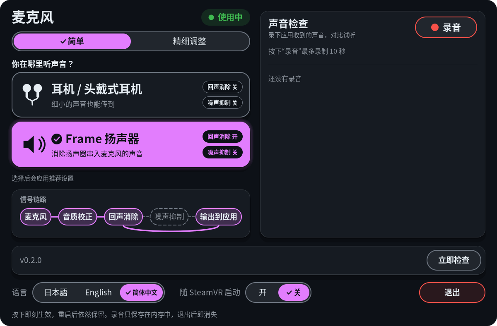
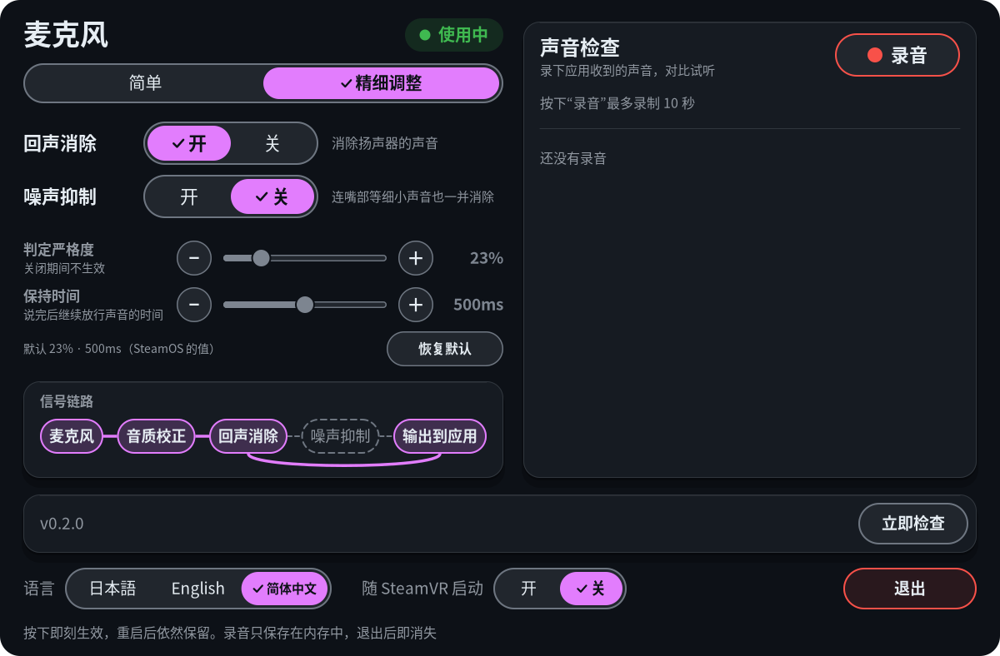

# Frame Mic Tuner

一款用于 Steam Frame 的 SteamVR 仪表盘面板：戴着它就能切换头显麦克风的回声消除与噪声抑制。用耳机时关闭回声消除，让口部杂音之类的细微声音也能清晰地传进去；用 Frame 的扬声器时再打开回声消除，避免扬声器的声音串进麦克风。内置的“声音检查”会录下几秒钟应用实际听到的声音，让你当场对比不同设置。

[English](README.en.md) | [日本語](README.ja.md)

| 简单（预设） | 精细调整 |
|---|---|
|  |  |

### 演示视频（有声音）

Frame 的扬声器播放暴风雪的声音，同时“声音检查”正在录音，然后回放这两段录音。第 1 段：关闭噪声抑制（扬声器预设）。第 2 段：连回声消除也关闭（耳机预设）。关闭回声消除后，扬声器里的暴风雪声会串进麦克风。视频中的面板是日文界面。

https://github.com/user-attachments/assets/14b5e180-f417-4d90-85f5-6ba1dc573546

## 功能

- **两个标签页**：**简单** 里是预设，**精细调整** 里是逐项开关和滑块。打开面板时会显示你上次使用的标签页。
- **按收听方式的预设**（简单标签页，“你在哪里听声音？”）：点一下 **耳机 / 头戴式耳机** 就把回声消除设为关、噪声抑制设为关；点一下 **Frame 扬声器** 则把回声消除设为开、噪声抑制设为关。每张卡片上都写明它会设置成什么，与当前设置一致的那张卡片会高亮。在 **精细调整** 标签页里，回声消除和噪声抑制也各有独立的开关；当你的设置与两个预设都不一致时，两张卡片都会变灰。改动立即生效，即使麦克风正在使用中也不会中断声音，重启后仍会保留。
- **噪声抑制强度**：两个滑块可以当场调节噪声抑制：**判定严格度**（声音要多像人声才能通过；调低会让更多声音通过）和 **保持时间**（你停止说话后声音继续通过的时间）。
- **信号链路**：显示是否有应用正在使用麦克风，以及声音实际经过了哪些滤镜（麦克风 → 音质校正 → 回声消除 → 噪声抑制 → 输出到应用），这些信息来自实时的 PipeWire 连接。
- **声音检查**：录制最多 10 秒应用最终收到的声音，保留最近 5 段录音，并通过 Frame 的扬声器或你的耳机回放。每条录音都会显示时间、长度、录制时使用的设置，以及一小段波形。
- **更新**：底部一行上方的更新提示条始终显示当前运行的版本。它大约每天向 GitHub 查询一次是否有新版本（可在设置文件里用 `update_check: false` 关闭），而 **立即检查** 则会马上查询，即使自动检查已关闭也一样。有新版本时，提示条会带上强调色边框并出现 **更新** 按钮，确认一次后它就会下载并安装。
- 日文、英文和简体中文界面。文字与控件的对比度符合 WCAG 2.x AA。

为什么需要它：当应用使用麦克风时，SteamOS 会让声音经过音质校正、回声消除和噪声抑制。回声消除会大幅削弱细微的声音，噪声抑制则会把听起来不像人声的声音变成静音。使用耳机时没有需要消除的扬声器声音，所以关闭回声消除能让你的声音更完整地传过去。

## 环境要求

- 一台已开启开发者模式并可通过 SSH 登录的 Steam Frame（设置 > 系统 > 开发者模式，然后在开发者选项里设置密码）。请设置强度高的密码：开启 SSH 后，同一网络中知道密码的人都能登录头显。
- 头显上装有 SteamVR。从源码构建（见下文）需要 cmake、ninja、g++、pkg-config 以及 cairo、FreeType、PipeWire 和 Vulkan 的开发文件，这些 SteamOS 已经自带；下载的发布包则不需要其中任何一个。

## 安装

本仓库是上游 [sasaken1102r/frame-mic-tuner](https://github.com/sasaken1102r/frame-mic-tuner) 的**简体中文版**。简体中文版的发布包只在本仓库的[发布页面](https://github.com/dhies23/frame-mic-tuner-zh/releases)上，请按下面“从 PC 安装”的步骤安装。

> 面板里的“更新”按钮检查的是**上游**仓库。如果上游发布了新版本，更新会装成上游的日文/英文版，中文界面会消失（面板会在你确认更新时提醒你）。要更新简体中文版，请回到本仓库的发布页面。

### 一键安装（装的是上游原版：日文/英文界面）

不需要 PC。在 Frame 的 Konsole（底部栏的 + → 程序列表 → Konsole）里输入下面的命令，按回车，然后在菜单中选择 **3**（frame-mic-tuner）。

```sh
curl -fsSL https://frame.sasaken1102s.net | sh
```

- 请先做这一步：Steam 设置 → 系统 → 打开“启用开发者模式”（关闭时 Konsole 不会出现在 + 列表里）。
- 其他应用（frameeyeosc、frame-jp-keyboard、frame-perf-overlay）也可以从同一个菜单安装。
- 要更新，运行同一条命令并再次选择同一个编号。要卸载，在菜单里使用 `u`。
- 分步指南和视频：https://frame.sasaken1102s.net
- 想不回答任何提示直接安装：`curl -fsSL https://frame.sasaken1102s.net | sh -s -- install mic`

安装的内容和选项与下面的“从 PC 安装”相同（它会替你运行 `install.sh`）。

### 从 PC 安装

从本仓库的[发布页面](https://github.com/dhies23/frame-mic-tuner-zh/releases)下载 `frame-mic-tuner-<version>.tar.gz` 并复制到头显上，例如在你的 PC 上：

```sh
scp frame-mic-tuner-*.tar.gz steamos@<headset-ip>:
```

然后在头显上（`ssh steamos@<headset-ip>`）：

```sh
tar xzf frame-mic-tuner-*.tar.gz
cd frame-mic-tuner
./install.sh
```

或者改为从源码构建（同样在头显上）：

```sh
git clone https://github.com/dhies23/frame-mic-tuner-zh.git
cd frame-mic-tuner-zh
./install.sh
```

然后**重启头显**一次，让 WirePlumber 加载切换脚本。游戏过程中不要手动重启 PipeWire 或 WirePlumber：SteamVR 和 Steam Link 会失去声音。如果还是发生了，在头显上重启 SteamVR（或重新连接 Steam Link），声音就会回来。

不需要 sudo。`install.sh` 会把所有内容放进你的主目录（`~/.local/bin`、`~/.local/share`、`~/.config`），所以 SteamOS 更新不会删除它。要手动更新：下载新的发布包并再次运行它的 `install.sh`（如果是在源码检出目录里，则是 `git pull && ./install.sh`）——或者等面板的更新提示条显示有新版本后直接按 **更新**。0.1.0 版没有更新提示条，所以从 0.1.0 升到 0.2.0 这一次只能手动完成。

安装的内容：

- 应用、仪表盘 **+**（启动程序）列表用的启动项，以及它的图标
- 一个 systemd 用户单元，用于随 SteamVR 一起启动（除非你打开它，否则不会启用；见下文）
- 一套 WirePlumber 脚本和配置（`contrib/wireplumber/`），它把 SteamOS 的麦克风追踪器替换成可以切换回声消除和噪声抑制的版本。除此之外的行为与原版一致。
- 共享的更新脚本（`~/.local/share/frame-mic-tuner/frame-update.sh`，来自 `vendor/frame-updater/`），供面板的更新提示条使用

要移除它：`./install.sh --uninstall`，然后重启头显，即可恢复 SteamOS 原本的麦克风行为。加上 `--purge` 还会删除应用的设置和保存的切换值。

## 使用

1. 打开 SteamVR 仪表盘，按 **+**（启动程序）并选择 **Frame Mic Tuner**。仪表盘底部一行会出现一个 **Mic** 图标；选中它即可打开面板。它已在运行时再次启动，只会打开面板。
2. 在 **简单** 标签页的 **你在哪里听声音？** 下面，选择 **耳机 / 头戴式耳机** 或 **Frame 扬声器**。这些是预设：它们把回声消除和噪声抑制设为推荐值（每张卡片上的标签会显示具体值）；噪声抑制强度滑块保持不变。想要更细的控制，就切到 **精细调整** 标签页。如果你的设置之后与两个预设都不一致，简单标签页上的两张卡片都会变灰并显示“当前使用精细调整的设置”，旁边有一个 **查看精细调整 →** 按钮；点某张卡片即可回到该预设。噪声抑制开启时会削掉细微的声音（口部杂音之类）。
   - 在 **精细调整** 标签页里，拖动 **判定严格度** 和 **保持时间** 滑块（或使用 − / ＋）来调节噪声抑制。SteamOS 的默认值是 23% 和 500 ms；**恢复默认** 可以把它们调回来。这两个滑块只在噪声抑制开启时才有效。
   - 每当 SteamOS 的音频重新启动（例如重启之后），它都会重置这两个值。应用会保存你的值，并在每次启动时重新应用，所以它们只在应用运行期间有效。想让它们一直生效，就打开 **随 SteamVR 启动**。没有这个应用时，使用的是 SteamOS 的默认值。
3. **声音检查**：按 **录音**，说点什么，再按 **停止**（10 秒后它会自动停止）。切换设置，再录一次，然后用每行上的 ▶ 对比。关闭面板后录音会立即停止。
4. **随 SteamVR 启动**（底部一行）：打开它，应用从此就会随 SteamVR 自动启动。也可以用 `./install.sh --autostart` 启用。
5. **语言**：面板会以你的 Steam Frame 的语言启动（Steam 设为简体中文或繁体中文时是简体中文，日文时是日文，英文时是英文，其他语言默认简体中文）。用左下角的 **日本語 / English / 简体中文** 切换；你的选择会被保存。
6. **退出**：按两次，或者在仪表盘里悬停在 Mic 图标上并选择“关闭”。
7. **更新**（底部一行上方的提示条）：它显示当前运行的版本，例如“已是最新版本（0.2.0）”。**立即检查** 会马上查找新版本（即使自动每日检查已关闭，这也有效）。
   - 有新版本时，提示条会带上强调色边框并显示“有新版本 X 可用”。按 **更新**；提示条会问“要更新到 X 吗？”，并有 **取消** 和 **更新**（这个问题会在 3 秒后自行消失）。再按一次 **更新** 就开始。随后提示条会显示进度（“更新中：下载中”等等）。
   - 安装期间面板会保持打开并继续运行旧版本。当提示条显示“已安装 X。退出并重新启动，即可使用新版本”时，按两次 **退出**，然后从 **+** 重新启动应用（或重启 SteamVR），如果那条消息还在，就按 **关闭**。如果新版本改动了 WirePlumber 脚本，还要重启头显（提示条会提醒你，更新日志里也会写明是否改动过）。
   - 如果提示条显示“此版本无法从这里安装。请到 GitHub 手动更新”（该发布包没有 `SHA256SUMS` 或没有可安装的文件），请按“安装”一节手动更新；提示条会显示发布页面。
   - 如果更新失败，提示条会带上红色边框，说明原因并说明没有改动任何内容，同时提供 **重试** 和 **关闭**。如果只是检查失败（例如没有网络），则只有文字变红，**立即检查** 仍然保留。

这些设置也可以通过 SSH 使用：

```sh
wpctl settings --save frame-mic.echo-cancel false        # 耳机：关闭回声消除
wpctl settings --save frame-mic.echo-cancel true         # 扬声器：打开回声消除（默认）
wpctl settings --save frame-mic.noise-suppression true   # 打开噪声抑制（默认：关）
~/.local/bin/frame-mic-tuner --print                     # 当前值、麦克风是否在用、信号链路
```

## 疑难解答

- **面板显示“切换组件尚未安装”**：WirePlumber 脚本还没有加载。运行 `./install.sh`，然后重启头显。
- **自启动按钮是灰色的**：systemd 单元没有安装。运行 `./install.sh`。
- **录音是静音的，或者别人完全听不到你**：检查头显混音器里的麦克风音量（只读，这是安全的）：
  ```sh
  amixer -c 0 cget name='VA_DEC0 Volume'
  amixer -c 0 cget name='VA_DEC1 Volume'
  ```
  两者都应显示 `values=96`。如果显示 `0`，麦克风实际上处于静音状态。这个应用从不改动混音器，但确实见过它自己掉到 0。要调回去（风险自负；先记下当前值和 `cget` 显示的 `max=`，并使用你头显通常的值，我们这边是 96）：
  ```sh
  amixer -c 0 cset name='VA_DEC0 Volume' 96
  amixer -c 0 cset name='VA_DEC1 Volume' 96
  ```
- **重启 PipeWire 或 WirePlumber 后 SteamVR 或 Steam Link 完全没有声音**：在头显上重启 SteamVR（或重新连接 Steam Link）。声音就会回来。
- **SteamOS 更新后完全没有声音**：切换脚本是作为 WirePlumber 的必需部分加载的，所以如果更新把它弄坏了，WirePlumber 可能会停止运行并带走所有声音。通过 SSH 删除该配置并重启头显（或者运行 `./install.sh --uninstall` 再重启）：
  ```sh
  rm ~/.config/wireplumber/wireplumber.conf.d/90-frame-mic.conf
  ```
- **你并没有在任何应用里说话却显示“使用中”**：任何录制音频的应用都会被算进去，包括录屏或录音工具。SteamOS 会为它们全部打开滤镜。
- **+ 列表里没有 Frame Mic Tuner**：安装后重启一次头显。
- **应用在运行，但仪表盘里没有 Mic 图标**：SteamVR 可能会丢失应用的仪表盘面板（例如仪表盘自身重启时）。应用每 3 秒检查一次并自行重建面板，所以等几秒钟再打开仪表盘。从 **+** 再次启动应用也会在打开面板前检查并重建。如果还是没有回来，日志（作为服务运行时是 `journalctl --user -u frame-mic-tuner -f`）会说明原因（找以“自修复”开头的行）；退出应用再启动也能修好。
- 日志：作为服务运行时是 `journalctl --user -u frame-mic-tuner -f`。要看手动运行的日志，请退出应用，然后从 SSH 启动 `~/.local/bin/frame-mic-tuner`。
- **更新检查失败，或者“更新”没有反应**：`~/.cache/frame-mic-tuner/update.log` 里有详细信息，`~/.cache/frame-mic-tuner/update-check.json` / `update-state.json` 里是上一次的原始应答。设置文件里的 `update_check: false` 会关闭自动每日检查，但不会移除更新提示条及其 **立即检查** / **更新** 按钮。

## 隐私

- 声音检查的录音只保存在应用的内存里。它们绝不会写入磁盘或日志，也不会被发送到任何地方。应用退出时它们就消失了。
- 录音期间，面板会显示“● 录音中”。关闭面板后录音会立即停止。
- 麦克风可能会录到周围人的说话声。录音前请留意这一点。
- 为了选择默认语言，它会在启动时读取一次 Steam 的 `~/.steam/registry.vdf` 里的 `language` 行（只读）。
- 应用没有遥测。它唯一的网络用途是更新检查：
  - **何时**：应用运行期间，如果上次的应答超过 24 小时，它会在启动时询问 GitHub，之后大约每天一次（检查失败后过一个小时）。**立即检查** 会马上询问。在设置文件里把 `update_check: false` 设为关闭自动检查；之后只有你按 **立即检查** 或 **更新** 时它才会联网。
  - **发送什么**：向 `api.github.com` 发一个 HTTPS 请求，查询本项目的最新发布，不带账号、ID 或使用数据。和任何网页请求一样，GitHub 会看到你的 IP 地址和 `curl` 的 User-Agent。你的录音、设置和日志绝不会被发送。
  - **收到什么**：最新发布的版本号、它的页面，以及其中文件的名称和链接。应答保存在 `~/.cache/frame-mic-tuner/update-check.json`。
  - **只有在你按下更新并确认时**，它才会从 `github.com` / `*.githubusercontent.com` 下载该发布包和 `SHA256SUMS`。
- 它写入的文件只有 `~/.config/frame-mic-tuner/config.json`（界面语言、上次的标签页、噪声抑制强度和更新检查设置）、`~/.config/frame-mic-tuner/install-args`（你上次运行 `./install.sh` 时用的选项，这样更新时会以相同方式重新安装）、`~/.cache/frame-mic-tuner/`（更新检查的缓存应答、更新的日志和状态、更新运行期间的锁文件夹 `update.lock/`，以及一个工作文件夹，其中的下载内容会在每次更新后删除），还有 `$XDG_RUNTIME_DIR` 里一个保存其进程 ID 的锁文件（用来阻止第二个副本启动）。更新还会重写已安装的文件，就像运行 `./install.sh` 一样。

## 免责声明

- 使用风险自负。本项目是用 AI 模型 Claude Opus 5.5 制作的。我在自己的 Steam Frame 上测试过，但无法为你的设备上发生的事情负责，所以请在运行前自行阅读并检查代码。本软件不提供任何担保（见 [LICENSE](LICENSE)）。
- 它改动的内容：两个 WirePlumber 设置 `frame-mic.echo-cancel` 和 `frame-mic.noise-suppression`（通过 `wpctl settings`）、噪声抑制器的两个实时参数 “VAD Threshold (%)” 和 “VAD Grace Period (ms)”（通过 `pw-cli set-param`；SteamOS 的音频重启时会恢复它的默认值），以及你主目录里 WirePlumber 的配置——它用自己的脚本替换了 SteamOS 的麦克风追踪器。除此之外，它只会在你要求时启用或禁用自身的 systemd 用户单元，以及在你从面板更新时，在一个短命的 systemd 用户单元（`frame-mic-tuner-update`）里运行新版本的 `install.sh`。
- 它从不重启 PipeWire 或 WirePlumber，从不写入 ALSA 混音器（amixer），从不接触 `/etc`，也从不需要 root。
- **更新**：通过 HTTPS 从 GitHub 下载最新发布包的 `.tar.gz` 和 `SHA256SUMS`（只连接 GitHub 自己的主机），校验哈希，只有通过后才解压到 `~/.cache/frame-mic-tuner/update/`，并用与上次安装相同的选项运行它的 `install.sh`。它会拒绝没有 `SHA256SUMS` 的发布包、哈希不匹配的发布包，以及包含绝对路径、`..`、链接或特殊文件的归档；出现任何这类情况都不会改动任何内容。下载内容之后会被删除。`SHA256SUMS` 是随同一发布一起提供的校验和，不是签名：它能发现下载损坏或不完整，但发现不了在 GitHub 上被替换过的发布。运行中的应用不会被重启：退出并重新启动它才能用上新版本。确切的步骤见 [frame-update.sh 自身的说明](vendor/frame-updater/frame-update.sh)。
- SteamOS 更新可能会改变麦克风滤镜的设置方式。如果发生这种情况，这些开关可能会失效，直到本项目跟进更新。由于切换脚本是 WirePlumber 的必需部分，一个不再能加载的脚本也可能让头显完全没声音（见“疑难解答”）。`./install.sh --uninstall` 加上重启即可恢复 SteamOS 原本的行为。
- 这是一个非官方项目，与 Valve Corporation 无任何隶属关系，也未获得其认可。Steam、Steam Frame、SteamVR 和 Steam Link 是 Valve Corporation 在美国和/或其他国家的商标和/或注册商标。这里使用这些名称只是为了说明本项目的适用范围。

## 开发

在头显上构建：

```sh
cmake -G Ninja -S . -B build && ninja -C build
./build/frame-mic-tuner --help
scripts/package.sh   # 发布构建：dist/frame-mic-tuner-<version>.tar.gz、dist/SHA256SUMS
```

不需要 SteamVR 的实用选项：`--print`、`--set-ns-vad N` / `--set-ns-grace N`（立即应用噪声抑制强度而不保存）、`--dump-png PATH`（渲染面板，配合 `--fake-*` 状态用于截图，包括更新提示条用的 `--fake-update STATE` 和 `--preview-update-confirm`）、`--test-record 3`（录 3 秒并回放）、`--contrast-report`（每一对颜色的 WCAG 对比度）以及 `--version`。设计说明、切换脚本的工作原理和测试结果都在 [docs/DEVELOPMENT.md](docs/DEVELOPMENT.md)（简体中文；日文原文是 [docs/DEVELOPMENT.ja.md](docs/DEVELOPMENT.ja.md)）。

更新机制（`vendor/frame-updater/`）复制自一个共享的私有仓库；不要手动改动这份副本——`sh vendor/frame-updater/verify.sh`（由 `scripts/package.sh` 运行）会检查它没有被改过。

### 发布

`scripts/package.sh` 会运行 `vendor/frame-updater/verify.sh`，构建 Release 版可执行文件，并写出 `dist/frame-mic-tuner-<version>.tar.gz` 和 `dist/SHA256SUMS`（面板的 **更新** 按钮需要它才会接受该发布）。它会打印创建 GitHub 发布（及其标签）并把两个文件作为附件的命令；请先把发布说明写在仓库之外的文件里：

```sh
gh release create v<version> dist/frame-mic-tuner-<version>.tar.gz dist/SHA256SUMS --title v<version> --notes-file <release-notes-file>
```

不要把它设为草稿或预发布：面板查看的是 GitHub 的最新发布，而这两种都会被跳过。

## 许可证

MIT。见 [LICENSE](LICENSE)。随附的 OpenVR 头文件（`third_party/openvr/`）是 Valve Corporation 的 BSD-3-Clause。`vendor/frame-updater/` 是作者自己的更新助手的副本，与本仓库其余部分一样是 MIT。随附头文件及其使用的库的许可证列在 [THIRD_PARTY_LICENSES.md](THIRD_PARTY_LICENSES.md)。改动列在 [CHANGELOG.md](CHANGELOG.md)。
